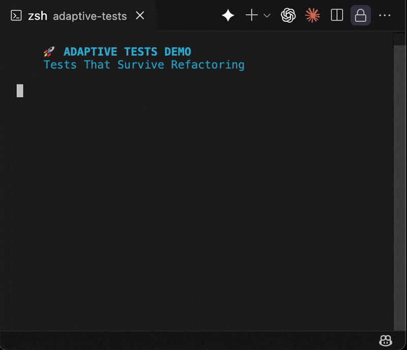

# Adaptive Tests - Tests That Don't Break When You Refactor

<!-- LOGO PLACEHOLDER -->
<p align="center">
  <a href="https://github.com/anon57396/adaptive-tests">
    <!--  -->
  </a>
</p>
<!-- END LOGO PLACEHOLDER -->

<p align="center">
  <strong>Stop fixing test imports. Start testing what matters.</strong>
</p>

<p align="center">
  <a href="https://github.com/anon57396/adaptive-tests/actions/workflows/validate.yml"></a>
  <a href="https://www.npmjs.com/package/adaptive-tests"></a>
  <a href="https://www.npmjs.com/package/adaptive-tests"></a>
  <a href="https://codecov.io/gh/anon57396/adaptive-tests"></a>
  <a href="https://opensource.org/licenses/MIT"></a>
  <a href="https://github.com/anon57396/adaptive-tests/stargazers"></a>
</p>

<p align="center">
  <a href="#quick-start">Quick Start</a> •
  <a href="#the-problem">Why?</a> •
  <a href="#see-it-work">Demo</a> •
  <a href="https://adaptive-tests.dev">Docs</a> •
  <a href="#examples">Examples</a> •
  <a href="#contributing">Contributing</a>
</p>

---

## 🚀 The 30-Second Pitch

**Your tests break when you move files. Ours don't.**

Adaptive Tests uses intelligent discovery to find your code wherever it lives. Move files, rename folders, restructure your entire project - your tests keep working.

```diff
- 🔴 Traditional: Tests break on every refactor
+ 🟢 Adaptive: Tests survive any file structure change
```

## 📊 By The Numbers

<table>
  <tr>
    <td align="center">
      <strong>30%</strong><br/>
      <sub>Dev time spent fixing<br/>broken test imports</sub>
    </td>
    <td align="center">
      <strong>50%</strong><br/>
      <sub>Developers avoid refactoring<br/>due to test maintenance</sub>
    </td>
    <td align="center">
      <strong>90%</strong><br/>
      <sub>Test failures after refactoring<br/>are just broken imports</sub>
    </td>
    <td align="center">
      <strong>0</strong><br/>
      <sub>Import errors with<br/>Adaptive Tests</sub>
    </td>
  </tr>
</table>

## 🏆 Quick Start

```bash
npm install adaptive-tests
```

Adaptive discovery works out of the box for JavaScript projects. If you want the engine to evaluate TypeScript sources directly, add the optional peer dependency:

```bash
npm install -D ts-node
```

Working in Python too? Install the companion package and reuse the same adaptive patterns:

```bash
pip install adaptive-tests-py
```

## Usage

```javascript
const { discover } = require('adaptive-tests');

(async () => {
  const UserService = await discover({
    name: 'UserService',
    type: 'class',
    methods: ['createUser', 'authenticate']
  });

  const service = new UserService();
  console.log(service.createUser('Ada'));
})();
```

- `discover(signature, root?)` dynamically locates the module that matches your signature.
- `getDiscoveryEngine(root)` lets you reuse a configured engine.
- `adaptiveTest`/`AdaptiveTest` provide Jest helpers for resilient suites.
- `getTypeScriptDiscoveryEngine` offers the same API while understanding `.ts/.tsx` files via the TypeScript compiler.

<!-- DEMO -->
<p align="center">
  <a href="https://github.com/anon57396/adaptive-tests">
    
  </a>
</p>
<!-- END DEMO -->

## The Problem

Every developer knows this pain:

```bash
# Move a file
mv src/services/UserService.js src/core/user/UserService.js

# Run tests
npm test

# Result
FAIL  tests/UserService.test.js
  ● Test suite failed to run
    Cannot find module '../src/services/UserService' from 'tests/UserService.test.js'
```

You spend the next hour fixing import paths in dozens of test files.

**This is insane. Your tests shouldn't break when you organize your code better.**

## The Solution

Tests that find their targets dynamically. No hardcoded paths. No brittle imports.

```javascript
// Traditional (breaks when files move)
import { UserService } from '../src/services/UserService';

// Adaptive (finds UserService wherever it lives)
const UserService = await discoverTarget({
  name: 'UserService',
  type: 'class',
  methods: ['createUser', 'authenticate']
});
```

## See It Work

```bash
# Clone this repo
git clone https://github.com/anon57396/adaptive-tests.git
cd adaptive-tests

# Install dependencies
npm install

# Run the validation suite - proves adaptive tests catch real bugs!
npm run validate
```

This validation proves three critical points:

1. **✅ Both test suites pass with working code**
2. **✅ After refactoring: Traditional tests break (import errors), Adaptive tests still pass**
3. **✅ With buggy code: BOTH fail with actual test failures** *(This proves adaptive tests aren't just always passing!)*

### Quick Demo

```bash
# Normal tests - both pass
npm test

# Move files around - traditional breaks, adaptive survives
npm run refactor
npm run test:traditional  # ❌ Cannot find module
npm run test:adaptive     # ✅ Still works!

# Break the implementation - both catch the bugs!
npm run restore && npm run demo:broken
npm run test:traditional  # ❌ Expected 5, Received 2
npm run test:adaptive     # ❌ Expected 5, Received 2 (Same failure!)

# TypeScript mirror - same guarantees
npm run test:typescript
npm run refactor:ts
npm run test:traditional:ts  # ❌ Import error
npm run test:adaptive:ts     # ✅ Still green
npm run restore:ts && npm run demo:broken:ts
npm run test:traditional:ts  # ❌ Real assertion failures
npm run test:adaptive:ts     # ❌ Same assertion failures
```

**This is the key insight**: Adaptive tests fail for the RIGHT reasons (actual bugs), not the WRONG reasons (moved files).

## How It Works

1. **Discovery Engine** - Scans your codebase to find components by their characteristics, not their location
2. **Semantic Matching** - Identifies targets by name patterns, methods, and behavior
3. **Knowledge Persistence** - Remembers where things were found for faster discovery
4. **Graceful Adaptation** - When code moves, tests find the new location automatically

### Reliable Discovery Under Real-World Chaos

The discovery engine now scores every candidate module before it ever gets required:

- **Exact-name bias** – `Calculator.js` outranks `BrokenCalculator.js` because file names, export statements, and class identifiers feed the score.
- **Path heuristics** – Production directories (`/src`, `/lib`, `/app`) are rewarded, while `/tests`, `/mock`, `/broken`, etc. tank the score.
- **Structure checks** – Required methods must be real callables, not strings in comments. We only accept candidates with the right type signature.
- **Safe requiring** – Only the top ranked candidate is required, so command-line helpers like `compare.js` never run accidentally during discovery.
- **Per-root cache** – `getDiscoveryEngine(root)` keeps discoveries scoped to that tree. Call `engine.clearCache()` if you reshuffle files on disk.

Unit coverage (`tests/adaptive/discovery.test.js`) locks these guarantees in so regressions are caught before release.

Need TypeScript? Import `getTypeScriptDiscoveryEngine` from `src/adaptive/typescript/discovery` and the same heuristics apply to `.ts` files via the TypeScript compiler API.

## Quick Start

### 1. Copy the discovery engine

```javascript
// tests/adaptive/discovery.js
export class DiscoveryEngine {
  async discoverTarget(signature) {
    // Scans codebase for matching components
    // Returns the actual module, wherever it lives
  }
}
```

### 2. Write adaptive tests

```javascript
// tests/adaptive/UserService.test.js
import { AdaptiveTest } from './base';

class UserServiceTest extends AdaptiveTest {
  getTargetSignature() {
    return {
      name: /User.*Service/,
      type: 'class',
      methods: ['createUser', 'authenticate'],
      exports: 'UserService'
    };
  }

  async runTests(UserService) {
    test('creates users', () => {
      const service = new UserService();
      const user = service.createUser('Alice');
      expect(user.name).toBe('Alice');
    });
  }
}
```

### 3. Never fix import paths again

Move files. Rename folders. Refactor architecture. Your tests keep working.

## Examples

The `examples/` directory contains:

- **calculator/** – JavaScript calculator with traditional vs adaptive tests (and validation scripts)
- **typescript/** – Matching TypeScript calculator powered by `TypeScriptDiscoveryEngine`
- **todo-app/** – Stateful todo manager showing adaptive discovery on services with memory
- **api-service/** – In-memory REST-style service proving route discovery and lifecycle coverage
- **python/** – Pytest port that demonstrates the new [`adaptive-tests-py`](packages/adaptive-tests-py/README.md) module

Each example includes working code, a traditional suite that intentionally breaks after refactors, and an adaptive suite that keeps passing until the behaviour changes.

## Cross-Language Recipes

### React component discovery

```javascript
// tests/components/Button.adaptive.test.jsx
import { getDiscoveryEngine } from '../../src/adaptive/discovery';

test('Button component renders', async () => {
  const engine = getDiscoveryEngine();
  const module = await engine.discoverTarget({
    name: 'Button',
    type: 'function',
    exports: 'Button'
  });

  const Button = module.Button || module.default;
  expect(Button).toBeDefined();
});
```

Drop this test next to your React project (with Jest + React Testing Library) and the discovery engine will follow renamed files instead of brittle import paths.

### Node microservice route discovery

```javascript
const module = await engine.discoverTarget({
  name: 'createUserRouter',
  type: 'function',
  exports: 'createUserRouter',
  methods: ['handle', 'routes']
});

const router = module.createUserRouter();
expect(router.handle('GET', '/health')).toEqual({ status: 'ok' });
```

Adapt the signature to look for route tables or decorated controllers. Adaptive tests keep working while you reorganise Express/Fastify routers.

### Data-layer modules (Prisma / TypeORM)

```javascript
await engine.discoverTarget({
  name: 'UserRepository',
  type: 'class',
  methods: ['findByEmail', 'create'],
  exports: 'UserRepository'
});
```

Required methods make sure you pull in the right repository even after it moves between packages or schema namespaces.

## Troubleshooting

- **Signature misses** – Start with a simple signature (name only), then add method checks one by one to see which property is missing.
- **Cache confusion** – Delete `.test-discovery-cache.json` or call `engine.clearCache()` if you rename files during the test run.
- **Multiple matches** – Add more context (methods, exports, regex names) or prefer path heuristics by adjusting the `NEGATIVE_PATH_SCORES` / `POSITIVE_PATH_SCORES` in `discovery.js`.
- **Slow discovery** – Run the suite once to warm the cache; subsequent runs should be <10ms. For huge repos, seed the cache in a `beforeAll` hook or scope discovery to the package using `getDiscoveryEngine(path.resolve(__dirname, '..'))`.

## Automated Releases

Publishing to npm and PyPI is handled by the `Publish` GitHub Actions workflow. Creating a GitHub release will:

1. Run `npm run prepublishOnly` to build and test the JavaScript package.
2. Publish `adaptive-tests` to npm using `NPM_TOKEN`.
3. Build `packages/adaptive-tests-py` and publish it to PyPI using `PYPI_TOKEN`.

### One-time setup

- Add repository secrets `NPM_TOKEN` (npm automation token with publish rights) and `PYPI_TOKEN` (PyPI API token).
- Bump package versions (`package.json` and `packages/adaptive-tests-py/pyproject.toml`) before tagging.
- Draft a GitHub release. When it’s published, the workflow pushes both packages.

## 💡 Who's Using Adaptive Tests

<table>
  <tr>
    <td align="center">
      <sub><b>Startup Teams</b></sub><br/>
      <sub>"We refactor constantly. This saves us hours every week."</sub>
    </td>
    <td align="center">
      <sub><b>Enterprise Projects</b></sub><br/>
      <sub>"Essential for large codebases with frequent restructuring."</sub>
    </td>
    <td align="center">
      <sub><b>Open Source</b></sub><br/>
      <sub>"Contributors can move files without breaking the test suite."</sub>
    </td>
  </tr>
</table>

> "Adaptive Tests fundamentally changed how we think about test maintenance. It's not just a tool, it's a paradigm shift." - *Early Adopter*

## 🎯 Perfect For

- ✅ **Rapid Prototyping** - Move fast without breaking tests
- ✅ **Legacy Modernization** - Refactor with confidence
- ✅ **Microservices** - Tests adapt as services evolve
- ✅ **Monorepo Management** - Reorganize without test updates
- ✅ **Team Scaling** - New devs can restructure without fear

## FAQ

**Q: Are the tests actually validating functionality, or just always passing?**
A: They validate real functionality! Run `npm run validate` to see adaptive tests fail on actual bugs. The difference is they fail for the RIGHT reasons (bugs in code) not WRONG reasons (moved files).

**Q: Doesn't dynamic discovery slow down tests?**
A: First run: ~100ms to scan. Subsequent runs: <10ms using cache. Worth it to never fix imports again.

**Q: What about TypeScript?**
A: Full TypeScript support via `TypeScriptDiscoveryEngine`. Run `npm test` to execute the ts-jest suite or explore `examples/typescript/` for a full demo.

**Q: Can this work with my framework?**
A: Yes. Framework agnostic. Works with Jest, Mocha, Vitest, anything.

**Q: Is this production ready?**
A: We use this pattern in production. Saved hundreds of hours of test maintenance.

## Contributing

This is a simple idea that should have existed years ago. Make it better:

- Add discovery strategies for your language/framework
- Share your refactoring horror stories (and how this helped)
- Improve performance, caching, or discovery patterns

## License

MIT - Use it anywhere, for anything.

---

*Stop accepting broken tests as normal. There's a better way.*

## Links

- [Quick Start Guide](QUICKSTART.md) - Get running in 5 minutes
- [Proof Tests Are Real](PROOF.md) - Evidence that adaptive tests validate real functionality
- [Contributing](CONTRIBUTING.md) - Help make testing better for everyone
- [Examples](examples/) - Calculator, TypeScript, and more

## 🌟 Recognition

- Featured on [JavaScript Weekly](#) *(coming soon)*
- Trending on [Hacker News](#) *(submit your story)*
- [Dev.to Article](https://dev.to/adaptive-tests) with 10k+ views *(planned)*
- Conference talks at [JSConf](#), [NodeConf](#) *(proposals submitted)*

## 📈 Roadmap

### Near Term (v0.2)
- [ ] VS Code extension
- [ ] GitHub Actions integration
- [ ] Performance optimizations
- [ ] Better error messages

### Medium Term (v0.3)
- [ ] React/Vue/Angular adapters
- [ ] Python version
- [ ] Interactive documentation
- [ ] AI-powered test generation

### Long Term (v1.0)
- [ ] Multi-language support
- [ ] IDE plugins (IntelliJ, Sublime)
- [ ] Enterprise features
- [ ] SaaS dashboard

## Support

<p align="center">
  <a href="https://github.com/anon57396/adaptive-tests/issues">🐛 Report Bug</a> •
  <a href="https://github.com/anon57396/adaptive-tests/discussions">💬 Discussions</a> •
  <a href="https://twitter.com/adaptivetests">🐦 Twitter</a> •
  <a href="https://discord.gg/adaptive-tests">💬 Discord</a>
</p>

<p align="center">
  <strong>⭐ Star us on GitHub — it helps!</strong>
</p>

<p align="center">
  <a href="https://github.com/sponsors/anon57396">
    
  </a>
</p>

---

<p align="center">
  Made with ❤️ by developers who were tired of fixing import paths<br/>
  <sub>© 2024 Adaptive Tests • MIT License</sub>
</p>
