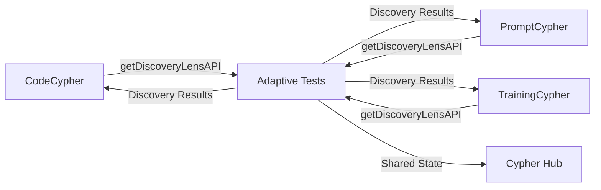

# Cypher Suite Integration Guide

This document describes how the Adaptive Tests VS Code extension integrates with the broader Cypher Suite ecosystem.

## 📋 Overview

The Adaptive Tests extension is designed as a **Phase 1** implementation of the Cypher Suite vision - a standalone VS Code extension with modular webviews that will eventually be unified into a single hub extension (Phase 2) and ultimately a desktop application (Phase 3).

## 🏗️ Architecture Alignment

### Phase 1 Requirements (✅ Met)

- **Modular Webviews**: Discovery Lens built as self-contained HTML/CSS/JS
- **Message-Passing API**: All communication via postMessage protocol
- **Decoupled Logic**: Business logic separated from VS Code APIs
- **Reusable Components**: Clean API surface for cross-extension use

### Phase 2 Readiness

The extension is fully prepared for hub integration:

```typescript
// Current modular structure
DiscoveryLensPanel (Webview) → Can be embedded as hub tab
IDiscoveryLensAPI (Interface) → Shared contract for all extensions
DiscoveryLensAPIFactory → Manages instances across extensions
```

## 🔌 Cross-Extension API

### For Other Cypher Suite Extensions

Other extensions in the Cypher Suite can access the Discovery Lens API:

```typescript
// In CodeCypher, PromptCypher, or TrainingCypher
import * as vscode from 'vscode';

async function useDiscoveryLens() {
    // Get the Adaptive Tests extension
    const adaptiveTests = vscode.extensions.getExtension('adaptive-tests.vscode-adaptive-tests');

    if (!adaptiveTests) {
        console.error('Adaptive Tests extension not installed');
        return;
    }

    // Activate if needed
    if (!adaptiveTests.isActive) {
        await adaptiveTests.activate();
    }

    // Get the API
    const api = adaptiveTests.exports;
    const discoveryLens = api.getDiscoveryLensAPI();

    // Use the Discovery Lens
    const results = await discoveryLens.runDiscovery({
        name: 'UserService',
        type: 'class',
        methods: ['create', 'update', 'delete']
    });

    // Subscribe to state changes
    const disposable = discoveryLens.onStateChange((state) => {
        console.log('Discovery state changed:', state);
    });

    // Show the Discovery Lens UI
    discoveryLens.show();

    // Set a signature programmatically
    discoveryLens.setSignature({
        name: 'Repository',
        type: 'interface'
    });
}
```

### Available APIs

```typescript
export interface ExtensionAPI {
    // Get the Discovery Lens API
    getDiscoveryLensAPI(options?: DiscoveryLensAPIOptions): IDiscoveryLensAPI;

    // Get the raw discovery engine
    getDiscoveryEngine(): Promise<DiscoveryEngine | null>;
}
```

## 🎯 Integration Points

### 1. CodeCypher Integration

CodeCypher can use discovery to understand code structure before refactoring:

```typescript
// Before refactoring, discover all references
const targets = await discoveryLens.runDiscovery({
    name: 'OldClassName',
    type: 'class'
});

// Use results to update imports across the codebase
targets.forEach(target => {
    // Refactor logic here
});
```

### 2. PromptCypher Integration

PromptCypher can use discovery to find relevant context for AI prompts:

```typescript
// Find all related code for prompt context
const context = await discoveryLens.runDiscovery({
    name: 'PaymentService',
    methods: ['processPayment']
});

// Include discovered files in prompt context
const prompt = buildPromptWithContext(context);
```

### 3. TrainingCypher Integration

TrainingCypher can use discovery to generate training data:

```typescript
// Discover test targets for training data generation
const testTargets = await discoveryLens.runDiscovery({
    type: 'class',
    methods: ['test*']
});

// Generate training examples from discovered code
const trainingData = generateTrainingData(testTargets);
```

## 🔄 Message Protocol

For deeper integration, extensions can communicate via messages:

```typescript
// Send discovery request to Adaptive Tests
vscode.commands.executeCommand('adaptive-tests.sendMessage', {
    source: 'code-cypher',
    target: 'adaptive-tests',
    type: 'discovery-request',
    payload: {
        signature: { name: 'Calculator', type: 'class' }
    },
    correlationId: 'req-123'
});

// Listen for responses
vscode.commands.registerCommand('code-cypher.receiveMessage', (message) => {
    if (message.type === 'discovery-response' && message.correlationId === 'req-123') {
        console.log('Discovery results:', message.payload);
    }
});
```

## 📦 Shared Types

All Cypher Suite extensions should import shared types:

```typescript
import {
    IDiscoveryLensAPI,
    DiscoveryResult,
    DiscoverySignature,
    DiscoveryState
} from 'adaptive-tests/types/api';
```

## 🎨 UI Integration for Phase 2

The Discovery Lens webview is designed for easy embedding:

```typescript
// Future unified hub extension
class CypherSuiteHub {
    private panels: Map<string, WebviewPanel> = new Map();

    async addDiscoveryLens() {
        // Get Discovery Lens HTML/CSS/JS
        const discoveryLens = await getDiscoveryLensContent();

        // Embed as a tab in unified interface
        this.panels.set('discovery', discoveryLens);
    }

    // Route messages between panels
    routeMessage(source: string, target: string, message: any) {
        const targetPanel = this.panels.get(target);
        targetPanel?.postMessage(message);
    }
}
```

## 🚀 Phase 3 Desktop App

The modular design enables desktop app migration:

```typescript
// Electron main process
import { BrowserWindow } from 'electron';

class CypherDesktopApp {
    private discoveryWindow: BrowserWindow;

    createDiscoveryWindow() {
        this.discoveryWindow = new BrowserWindow({
            webPreferences: {
                preload: path.join(__dirname, 'preload.js')
            }
        });

        // Load the same Discovery Lens HTML
        this.discoveryWindow.loadFile('discovery-lens.html');

        // Handle IPC messages (replacing VS Code postMessage)
        ipcMain.handle('discovery-run', async (event, signature) => {
            const engine = getDiscoveryEngine();
            return await engine.discover(signature);
        });
    }
}
```

## 📊 Data Flow



## ✅ Compliance Checklist

- [x] **Modular Webview**: Discovery Lens built as self-contained module
- [x] **Message-Passing API**: All communication via messages
- [x] **Decoupled Logic**: Clean separation of concerns
- [x] **Export API**: Public API for cross-extension use
- [x] **State Management**: Centralized state with subscriptions
- [x] **Type Safety**: Full TypeScript with exported interfaces
- [x] **Documentation**: Clear integration guide
- [x] **Future-Proof**: Ready for Phase 2 & 3 transitions

## 🔧 Testing Cross-Extension Integration

1. Install both extensions:
   ```bash
   code --install-extension adaptive-tests.vsix
   code --install-extension code-cypher.vsix
   ```

2. Test API access:
   ```typescript
   // In CodeCypher's extension.ts
   const adaptiveTests = vscode.extensions.getExtension('adaptive-tests.vscode-adaptive-tests');
   console.log('API available:', adaptiveTests?.exports);
   ```

3. Test discovery:
   ```typescript
   const api = adaptiveTests.exports;
   const results = await api.getDiscoveryLensAPI().runDiscovery({
       name: 'TestClass'
   });
   console.log('Found:', results.length, 'matches');
   ```

## 📝 Best Practices

1. **Always Check Extension Availability**: Other extensions should gracefully handle when Adaptive Tests isn't installed
2. **Use Type Guards**: Validate API responses before use
3. **Subscribe Responsibly**: Always dispose of event subscriptions
4. **Cache Discovery Results**: Avoid redundant discovery operations
5. **Respect User Settings**: Honor Adaptive Tests configuration

## 🚦 Next Steps

1. **Implement Message Router**: For Phase 2 hub communication
2. **Create Shared Types Package**: `@cypher-suite/types`
3. **Build Hub Container**: Unified webview container for all tools
4. **Develop IPC Bridge**: For Phase 3 Electron migration

---

**Remember**: This extension is part of a larger vision. Every architectural decision should consider future integration with the Cypher Suite ecosystem.